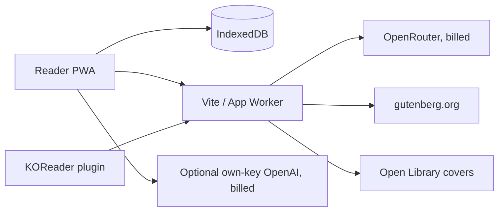

# Service and data boundaries

Deploy adapters share `shared/relay.ts`, `shared/gutenberg.ts` and
`shared/covers.ts`; they must not import browser modules.

## Local storage schema

`src/db/types.ts` defines records; `src/db/db.ts` owns Dexie versions 1–5.
Books own highlights, conversations, and memory. Conversations own messages.
Compound indexes group children by book/conversation plus creation/update time.
Version 2 repairs old digest delimiters, version 3 adds archives, and version 4
adds external-id indexes for idempotent KOReader import, and version 5 drops the
removed audiobook token and position from settings. Do not rewrite migration
history. Use transactions and bulk `anyOf` lookups instead of per-row queries.
Deletion cascades; archiving removes EPUB bytes but preserves notes and file hash.

HTTP contracts are `docs/api.openapi.yml`. Lua-to-reader handoff validation is
`src/lib/koreader.ts`, exercised with synthetic fixtures and the real Lua VM.

## External services

Chat sends the user-selected context to the chosen model provider. Offline
reading and normal tests need no external services.
The app sends no third-party telemetry. Worker metrics are fixed operation names,
status codes, and numeric durations.
